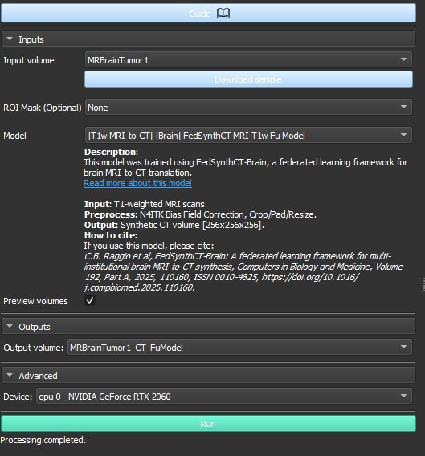
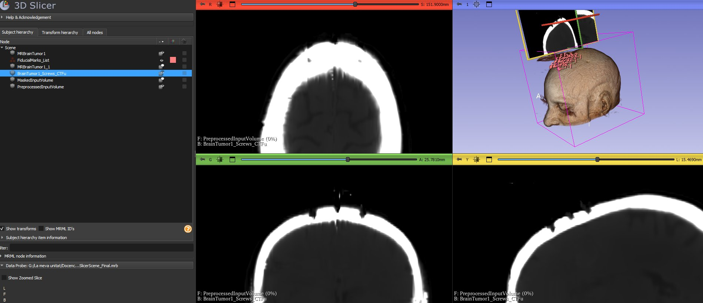

# 02 — MRI to Synthetic CT Conversion

Converts T1-weighted MRI brain scans to synthetic CT (sCT) using the **FedSynthCT-Brain** federated learning model, integrated in the **SlicerModalityConverter** extension. The synthetic CT provides Hounsfield Unit (HU) values needed for bone segmentation — tasks where MRI alone is insufficient.

---

## Why Synthetic CT?

MRI provides excellent soft tissue contrast but cannot reliably distinguish bone from other structures because cortical bone appears dark and featureless. CT is the gold standard for rigid tissue imaging, but requires additional ionising radiation exposure. Synthetic CT eliminates the need for a separate CT scan by learning the MRI → CT mapping from paired training data using deep learning.

---

## Step 1 — Install the ModalityConverter Extension

1. Open **3D Slicer** (≥ 5.8)
2. Go to **Edit → Extension Manager** (or click the extension icon in the toolbar)
3. In the search box type: `ModalityConverter`
4. Click **Install** next to **SlicerModalityConverter**
5. When installation completes, click **Restart Slicer**

> The extension is listed under the **Image Synthesis** category in the Extension Manager.

---

## Step 2 — Load the MRI with Screws

1. Go to **File → Load Scene**
2. Load `01_Slicer_FiducialScrews/data/01_MRBrainTumor1_MRI_Screws_FiducialMarkers.mrb`
3. Verify `MRBrainTumorWithScrews` appears in the Data panel

> Or load your own MRI volume if you followed module 01 manually.

---

## Step 3 — Open the ModalityConverter Module

Go to **Modules → Image Synthesis → ModalityConverter**

Or use the module search bar (Ctrl+F) and type `ModalityConverter`

---

## Step 4 — Configure the Module

Set the following parameters (see screenshot below):

| Parameter | Value | Notes |
|---|---|---|
| **Input volume** | `MRBrainTumorWithScrews` | The MRI with simulated screws |
| **ROI Mask** | `None` | Leave empty — do not use a mask |
| **Model** | `[T1w MRI-to-CT] [Brain] FedSynthCT MRI-T1w Fu Model` | See model selection below |
| **Output volume** | `CTBrain_NotAligned` | Name clearly — it will be renamed after alignment |
| **Device** | `gpu 0 - NVIDIA GeForce ...` | Use GPU if available — significantly faster |



---

## Model Selection — Why the Fu Model?

Three brain MRI-to-CT models are available, all trained using the FedSynthCT-Brain federated learning framework:

| Model | Architecture | Recommendation |
|---|---|---|
| `FedSynthCT MRI-T1w Li Model` | U-Net (Li et al.) | Fastest — lightest architecture |
| **`FedSynthCT MRI-T1w Fu Model`** | **U-Net (Fu et al.)** | **Best results — use this one** |
| `FedSynthCT MRI-T1w Spadea Model` | U-Net (Spadea, Pileggi et al.) | Alternative architecture |

**Use the Fu Model** — among the three it produces the most accurate synthetic CT with the best bone contrast and fewest artefacts on the MRBrainTumor1 dataset. This is critical for the downstream skull segmentation step.

---

## Step 5 — Run the Conversion

1. Click **Run**
2. The status bar shows `Processing completed.` when done (30–120 seconds depending on GPU/CPU)
3. The output volume appears in the Data panel

---

## Step 6 — Verify the Output

Switch to the CT volume and set a bone window to confirm the skull is clearly visible:

```python
# Run in Python Interactor (View → Python Interactor)
ctNode = slicer.util.getNode("CTBrain_NotAligned")
slicer.util.setSliceViewerLayers(background=ctNode, fit=True)
displayNode = ctNode.GetVolumeDisplayNode()
displayNode.SetWindow(1500)
displayNode.SetLevel(400)
print(f"CT range: {ctNode.GetImageData().GetScalarRange()}")
```

Expected output: CT range approximately `-1024` to `1600` HU. Bone should appear bright white.

### Expected result



The synthetic CT clearly shows:
- **Axial (top-left)** — bright white skull ring with the 9 screw signals visible as high-intensity spots
- **3D rendering (top-right)** — fiducial marker labels overlaid on the skull surface
- **Coronal and Sagittal** — clean bone contrast with soft tissue visible

### Bone window — high contrast view

For clearer bone visualisation, narrow the window:

```python
displayNode.SetWindow(400)
displayNode.SetLevel(200)
```


---

## Step 7 — Align CT to MRI

> ⚠️ **This step is required.** The ModalityConverter preprocessing pads the MRI to 256×256×256 voxels, shifting the CT anatomy upward by ~100mm in S relative to the MRI. Without correction, fiducial markers and segmentations will not align correctly.

### Run the interactive alignment script

Open the Python Interactor (`View → Python Interactor`) and paste the contents of:

**`scripts/align_CT_to_MRI.py`**

The script guides you through 5 steps with GUI dialogs:

| Step | Action |
|---|---|
| 1 | Enter MRI and CT volume names (validated against scene) |
| 2 | Automatic S-axis offset computed from bone centroids |
| 3 | MRI/CT overlay set up for visual verification |
| 4 | Interactive fine-tuning loop — adjust R, A, S until aligned |
| 5 | Harden transform permanently into CT volume |

### What correct alignment looks like

When aligned, in all 3 slice views:
- The **CT skull ring** (bright white) overlaps the **MRI skull ring** (grey)
- The **fiducial markers** sit on the bone surface
- The **screw shafts** are visible at the correct position in sagittal view

### Why the offset occurs

The FedSynthCT preprocessing pads shorter volumes asymmetrically — extra slices are added **superiorly only** (never into the neck), shifting the anatomical content upward:

```
MRI input  : 112 slices   S = -77.7 to +79.1 mm
CT output  : 256 slices   S = -77.7 to +280.7 mm  (+144 slices above)
Anatomy shift: ~100mm upward in S
Fine-tune  : +6mm additional (N4ITK bias correction sub-voxel shift)
```

The alignment script corrects this automatically. See the **Known Issue** section below for full technical details.

### After hardening

The CT volume is renamed to `CTBrain_Aligned` and its origin is permanently corrected. Verify the final S range:

```python
import vtk
ctNode  = slicer.util.getNode("CTBrain_Aligned")
ijkToRAS = vtk.vtkMatrix4x4()
ctNode.GetIJKToRASMatrix(ijkToRAS)
dims    = ctNode.GetImageData().GetDimensions()
corner0 = ijkToRAS.MultiplyPoint([0, 0, 0, 1])
cornerN = ijkToRAS.MultiplyPoint([dims[0], dims[1], dims[2], 1])
print(f"CT  S range: {round(corner0[2],1)} to {round(cornerN[2],1)} mm")
print(f"MRI S range: -77.7 to +79.1 mm")
```

---

## Output

| Node | Type | Description |
|---|---|---|
| `CTBrain_Aligned` | Scalar Volume | Synthetic CT [256×256×256], aligned to MRI |

This volume is the input for **[03 — Segmentation](../03_Slicer_Segmentation/README.md)**.

---

## Known Issue — Vertical Misalignment in 3D Rendering

When both the MRI and CT are displayed simultaneously in the 3D view before alignment, a **vertical offset of ~100mm** is visible. This is expected — see Step 7 above for the fix.

### Root cause

| Property | MRI | Synthetic CT (before alignment) |
|---|---|---|
| S range | -77.7 to **+79.1 mm** | -77.7 to **+280.7 mm** |
| Slices | 112 | 256 |
| Volume centre (S) | 0.7 mm | **101.5 mm** |

The origin is **identical** for both volumes but the bounding box centres differ by ~101mm, causing the 3D render shift. The 2D slice views are unaffected because they navigate by S coordinate, not bounding box centre.

### Workaround for 3D rendering only (cosmetic)

```python
# Crop CT 3D rendering to MRI S coverage
ctNode  = slicer.util.getNode("CTBrain_Aligned")
vrLogic = slicer.modules.volumerendering.logic()
vrNode  = vrLogic.GetFirstVolumeRenderingDisplayNode(ctNode)
if vrNode:
    roiNode = vrNode.GetROINode()
    roiNode.SetXYZ(0, 0, 0.7)
    roiNode.SetRadiusXYZ(120, 120, 78)
    vrNode.SetCroppingEnabled(True)
    print("CT rendering cropped to MRI coverage.")
```

---

## Portable Scene Bundle

A complete Slicer scene bundle for this module is available in the repository:

**`02_Slicer_MRI_to_CT/data/03_MBRBrainTumor1_MRI_CT_Screws.mrb`**

| Node | Type | Description |
|---|---|---|
| `MRBrainTumorWithScrews` | Volume | MRI with 9 simulated screws |
| `CTBrain_Aligned` | Volume | Synthetic CT aligned to MRI (Fu Model) |
| `FiducialMarks_List` | Markups | 9 screw base coordinates |
| `FiducialTips_List` | Markups | 9 screw tip coordinates (4mm protrusion) |

```
File → Load Scene → 02_Slicer_MRI_to_CT/data/03_MBRBrainTumor1_MRI_CT_Screws.mrb
```

This bundle is the starting point for **[03 — Segmentation](../03_Slicer_Segmentation/README.md)**.

---

## Citation

> C.B. Raggio et al., *FedSynthCT-Brain: A federated learning framework for multi-institutional brain MRI-to-CT synthesis*, Computers in Biology and Medicine, Volume 192, Part A, 2025, 110160.
> https://doi.org/10.1016/j.compbiomed.2025.110160

> Raggio C.B., Zaffino P., Spadea M.F., *SlicerModalityConverter*, 2025.
> https://github.com/ciroraggio/SlicerModalityConverter
