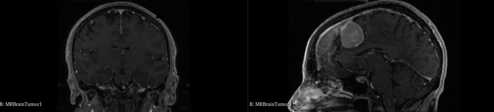
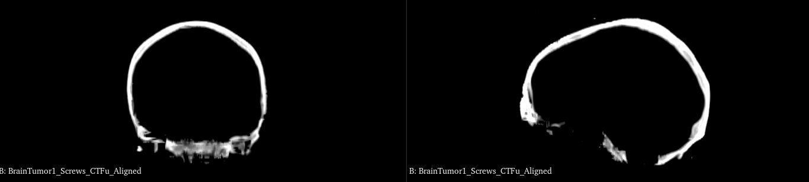
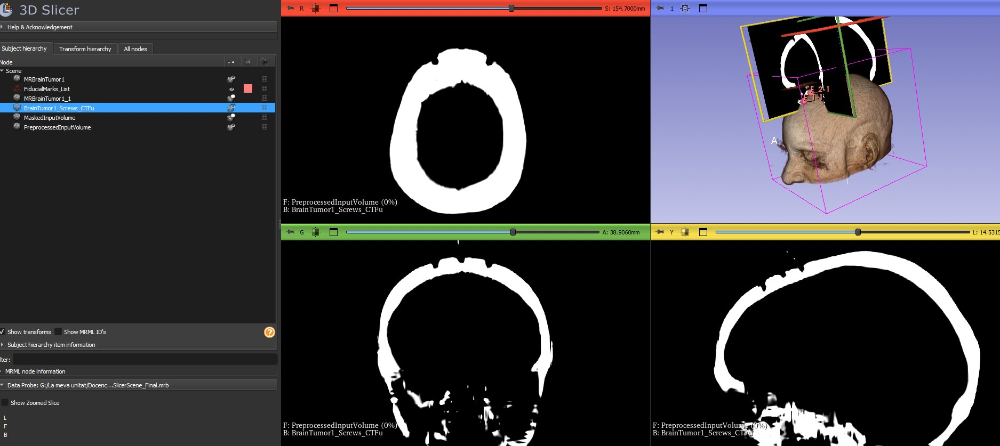
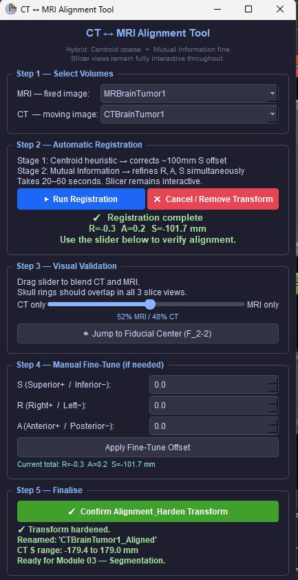

# 02 — MRI to Synthetic CT Conversion

Converts T1-weighted MRI brain scans to synthetic CT (sCT) using the **FedSynthCT-Brain** federated learning model, integrated in the **SlicerModalityConverter** extension. The synthetic CT provides Hounsfield Unit (HU) values needed for bone segmentation — tasks where MRI alone is insufficient.

> **Reference:** C.B. Raggio et al., *FedSynthCT-Brain: A federated learning framework for multi-institutional brain MRI-to-CT synthesis*, Computers in Biology and Medicine, Vol. 192, Part A, 2025, 110160. https://doi.org/10.1016/j.compbiomed.2025.110160

---

## Why Synthetic CT?

MRI provides excellent soft tissue contrast but cannot reliably distinguish bone from other structures because cortical bone appears dark and featureless. CT is the gold standard for rigid tissue imaging, but requires additional ionising radiation exposure. Synthetic CT eliminates the need for a separate CT scan by learning the MRI → CT mapping from paired training data using deep learning.

| MRI (T1-weighted) | Synthetic CT |
|---|---|
|  |  |
| Excellent soft tissue contrast — tumour clearly visible | Excellent bone contrast — skull ring clearly defined |
| Bone appears dark and featureless | Cortical bone appears bright white (high HU values) |
| Used for: tumour segmentation, fiducial placement | Used for: skull segmentation, registration, dose planning |

---

## Step 1 — Install the ModalityConverter Extension

1. Open **3D Slicer** (≥ 5.8)
2. Go to **Edit → Extension Manager** (or click the extension icon in the toolbar)
3. In the search box type: `ModalityConverter`
4. Click **Install** next to **SlicerModalityConverter**
5. When installation completes, click **Restart Slicer**

> The extension is listed under the **Image Synthesis** category in the Extension Manager.

---

## Step 2 — Load the MRI with Screws

1. Go to **File → Load Scene**
2. Load `01_Slicer_FiducialScrews/data/01_MRBrainTumor1_MRI_Screws_FiducialMarkers.mrb`
3. Verify `MRBrainTumorWithScrews` appears in the Data panel

> Or load your own MRI volume if you followed module 01 manually.

---

## Step 3 — Open the ModalityConverter Module

Go to **Modules → Image Synthesis → ModalityConverter**

Or use the module search bar (Ctrl+F) and type `ModalityConverter`

---

## Step 4 — Configure the Module

Set the following parameters (see screenshot below):

| Parameter | Value | Notes |
|---|---|---|
| **Input volume** | `MRBrainTumorWithScrews` | The MRI with simulated screws |
| **ROI Mask** | `None` | Leave empty — do not use a mask |
| **Model** | `[T1w MRI-to-CT] [Brain] FedSynthCT MRI-T1w Fu Model` | See model selection below |
| **Output volume** | `CTBrain_NotAligned` | Name clearly — will be renamed after alignment |
| **Device** | `gpu 0 - NVIDIA GeForce ...` | Use GPU if available — significantly faster |


---

## Model Selection — Why the Fu Model?

All three models available in SlicerModalityConverter use a **U-Net-based deep learning architecture** trained within the FedSynthCT-Brain federated learning framework. The model names refer to the backbone U-Net design used at each federated client centre:

| Model | Backbone | Reference |
|---|---|---|
| `FedSynthCT MRI-T1w Li Model` | U-Net variant (Centre B architecture) | Internal to FedSynthCT-Brain \[1\] |
| **`FedSynthCT MRI-T1w Fu Model`** | **U-Net variant (Centre A architecture)** | **Internal to FedSynthCT-Brain \[1\] — best results** |
| `FedSynthCT MRI-T1w Spadea Model` | Deep CNN multiplane U-Net | Spadea, Pileggi et al., Int J Radiat Oncol Biol Phys, 2019 \[2\] |

**Use the Fu Model** — among the three it produces the most accurate synthetic CT with the best bone contrast and fewest artefacts on the MRBrainTumor1 dataset.

> \[1\] C.B. Raggio et al., *FedSynthCT-Brain*, Computers in Biology and Medicine, 2025. https://doi.org/10.1016/j.compbiomed.2025.110160
>
> \[2\] M.F. Spadea, G. Pileggi, P. Zaffino et al., *Deep convolution neural network (DCNN) multiplane approach to synthetic CT generation from MR images — application in brain proton therapy*, Int J Radiat Oncol Biol Phys, 105(3):495–503, 2019. https://doi.org/10.1016/j.ijrobp.2019.06.2535

---

## Step 5 — Run the Conversion

1. Click **Run**
2. The status bar shows `Processing completed.` when done (30–120 seconds depending on GPU/CPU)
3. The output volume appears in the Data panel

---

## Step 6 — Verify the Output

Switch to the CT volume in the slice views and set a bone window. You can do this via the **Volumes module** (`Modules → Volumes → Display → Window/Level`) or directly in the slice view toolbar.

Set: **Window = 1500, Level = 400** for standard bone visualisation.

Expected: CT range approximately `-1024` to `1600` HU. Bone should appear bright white.

### Expected result


The synthetic CT clearly shows:
- **Axial (top-left)** — bright white skull ring with the 9 screw signals visible as high-intensity spots
- **3D rendering (top-right)** — fiducial marker labels overlaid on the skull surface
- **Coronal and Sagittal** — clean bone contrast with soft tissue visible

### Bone window — high contrast view

For clearer bone visualisation, set **Window = 400, Level = 200**. The skull cortex appears pure white and soft tissue disappears — ideal for segmentation.



---

## Step 7 — Align CT to MRI

> ⚠️ **This step is required.** The ModalityConverter preprocessing pads the MRI to 256×256×256 voxels, shifting the CT anatomy upward by ~100mm in S relative to the MRI. Without correction, fiducial markers and segmentations will not align correctly.

### Why the offset occurs

The FedSynthCT preprocessing pads shorter volumes asymmetrically — extra slices are added **superiorly only** (never into the neck), shifting the anatomical content upward:

```
MRI input  : 112 slices   S = -77.7 to +79.1 mm
CT output  : 256 slices   S = -77.7 to +280.7 mm  (+144 slices above)
Anatomy shift: ~100mm upward in S
Additional : ~6mm (N4ITK bias field correction sub-voxel shift)
```

### Registration method — Hybrid coarse-to-fine

The alignment script uses a two-stage hybrid approach:

**Stage 1 — Intensity centroid heuristic (coarse)**
Computes the centre of mass of bright voxels in the MRI (tissue threshold > 300) and bone voxels in the CT (HU threshold > 200 HU), then calculates the S-axis offset between them. This robustly handles the large ~100mm initial offset in a few seconds.

**Stage 2 — Mattes Mutual Information registration (fine)**
Uses SimpleITK's `ImageRegistrationMethod` with Mattes Mutual Information metric — the standard approach for multi-modal MRI↔CT registration. Starting from the coarse estimate (so the large initial offset is already corrected), it optimises translation in R, A and S simultaneously using a Regular Step Gradient Descent optimiser with a multi-resolution pyramid (2x → 1x). This refines the residual sub-millimetre misalignment in all three axes.

### Run the interactive alignment script

Open the Python Interactor (`View → Python Interactor`) and paste the contents of:

**`scripts/align_CT_to_MRI.py`**

A **non-modal floating panel** opens — Slicer views remain fully interactive throughout.



| Panel step | Action |
|---|---|
| **Step 1** | Select MRI and CT volumes from dropdowns (auto-populated from scene) |
| **Step 2** | Click **Run Registration** — spinner shows progress, Slicer stays interactive |
| **Step 3** | Drag opacity slider (CT only ↔ MRI only) to verify skull ring overlap in all 3 views |
| **Step 4** | Optional spinboxes for manual fine-tune in R, A, S if residual offset remains |
| **Step 5** | Click **Confirm & Harden** to permanently bake the correction into the CT volume |

The **Cancel / Remove Transform** button (red) is available after registration to undo the alignment and return the CT to its original position — no scene restart needed.

### What correct alignment looks like

When aligned, in all 3 slice views:
- The **CT skull ring** (bright white) overlaps the **MRI skull ring** (grey)
- The **fiducial markers** sit on the bone surface
- The **screw shafts** are visible at the correct position in the sagittal view

After hardening, the CT is renamed to `CTBrain_Aligned` and its S range corrects to approximately `-179 to +179 mm`, matching the MRI coverage.

---

## Output

| Node | Type | Description |
|---|---|---|
| `CTBrain_Aligned` | Scalar Volume | Synthetic CT [256×256×256], aligned to MRI |

This volume is the input for **[03 — Segmentation](../03_Slicer_Segmentation/README.md)**.

---

## Known Issue — Vertical Misalignment in 3D Rendering

Before running the alignment script, both MRI and CT displayed together in the 3D view show a **~100mm vertical offset**. This is expected — Step 7 above corrects it.

| Property | MRI | Synthetic CT (before alignment) |
|---|---|---|
| S range | -77.7 to **+79.1 mm** | -77.7 to **+280.7 mm** |
| Slices | 112 | 256 |
| Volume centre (S) | 0.7 mm | **101.5 mm** |

The 2D slice views are unaffected because they navigate by S coordinate, not bounding box centre.

---

## Portable Scene Bundle

**`02_Slicer_MRI_to_CT/data/03_MBRBrainTumor1_MRI_CT_Screws.mrb`**

| Node | Type | Description |
|---|---|---|
| `MRBrainTumorWithScrews` | Volume | MRI with 9 simulated screws |
| `CTBrain_Aligned` | Volume | Synthetic CT aligned to MRI (Fu Model) |
| `FiducialMarks_List` | Markups | 9 screw base coordinates |
| `FiducialTips_List` | Markups | 9 screw tip coordinates (4mm protrusion) |

```
File → Load Scene → 02_Slicer_MRI_to_CT/data/03_MBRBrainTumor1_MRI_CT_Screws.mrb
```

---

## Citation

> \[1\] C.B. Raggio et al., *FedSynthCT-Brain: A federated learning framework for multi-institutional brain MRI-to-CT synthesis*, Computers in Biology and Medicine, Vol. 192, Part A, 2025, 110160.
> https://doi.org/10.1016/j.compbiomed.2025.110160

> \[2\] M.F. Spadea, G. Pileggi, P. Zaffino et al., *Deep convolution neural network (DCNN) multiplane approach to synthetic CT generation from MR images — application in brain proton therapy*, Int J Radiat Oncol Biol Phys, 105(3):495–503, 2019.
> https://doi.org/10.1016/j.ijrobp.2019.06.2535

> Raggio C.B., Zaffino P., Spadea M.F., *SlicerModalityConverter*, 2025.
> https://github.com/ciroraggio/SlicerModalityConverter
