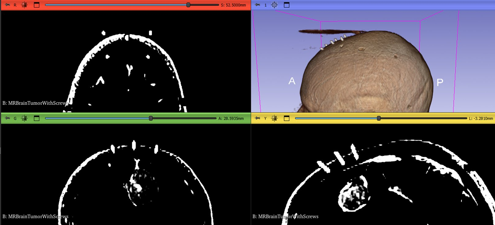
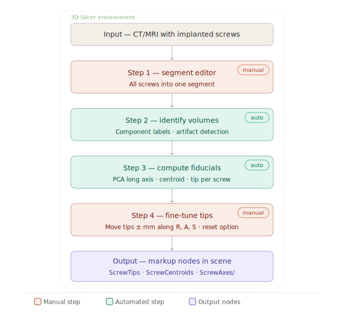
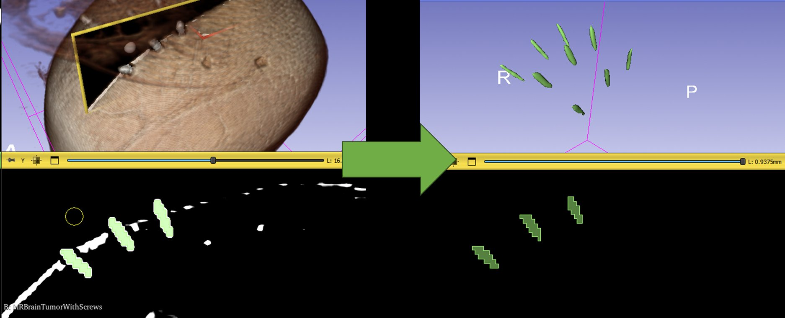
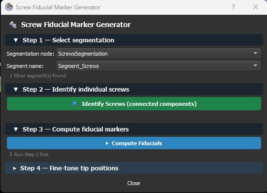
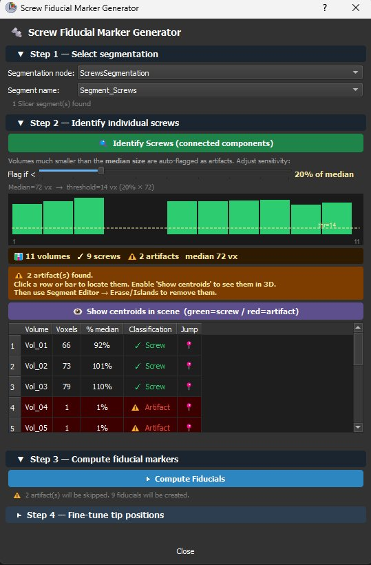
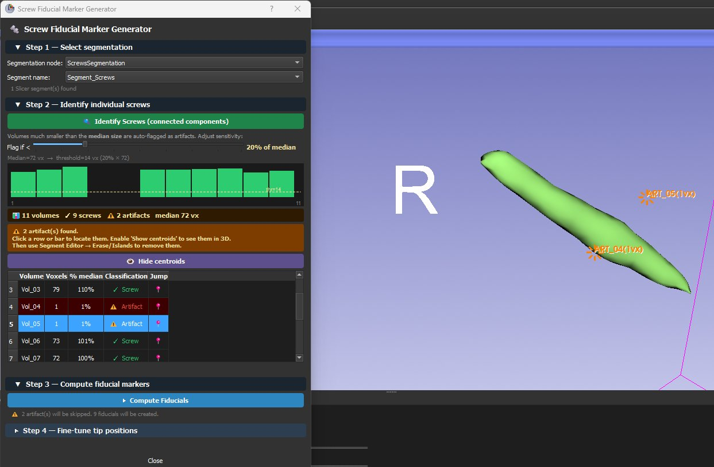
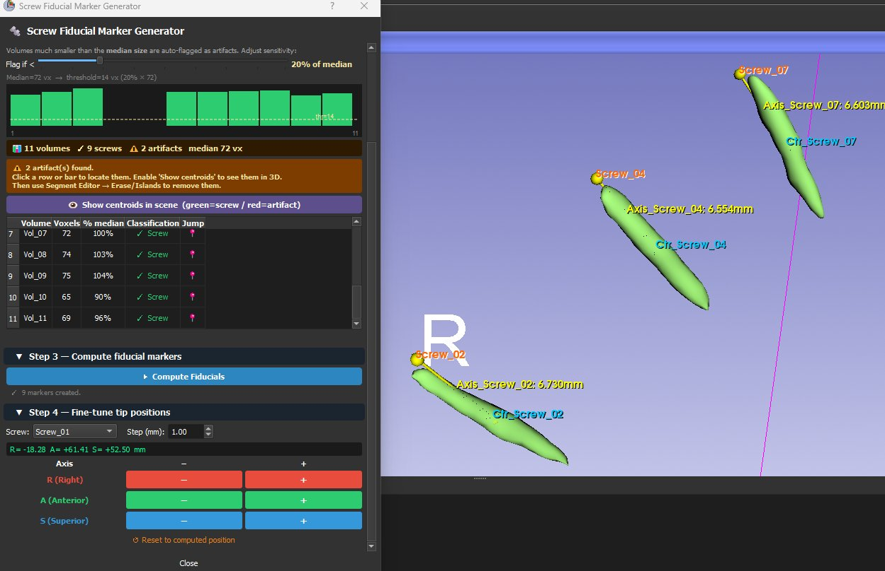
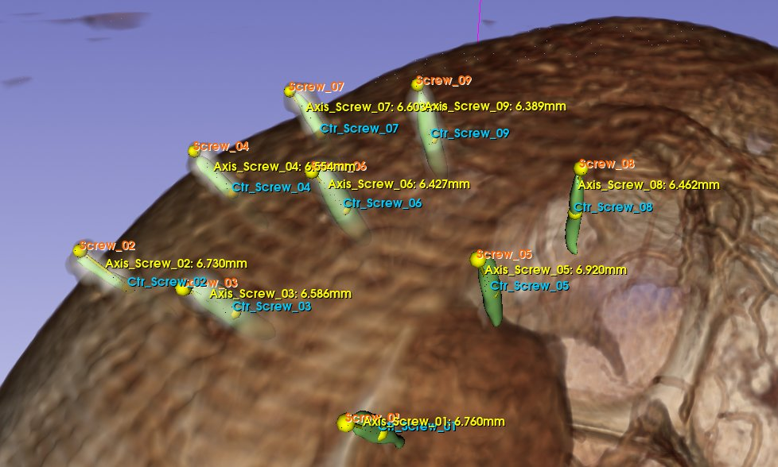
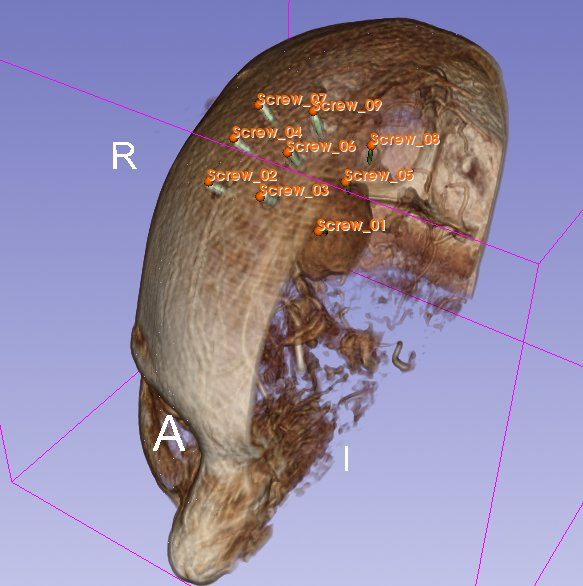

# Screw Fiducial Marker Generator

Automated detection and placement of fiducial markers on segmented bone screws in **3D Slicer**, designed for surgical robotics registration pipelines.

---

## Context

In robotic stereotactic brain biopsy, **registration** is the process of aligning the pre-operative virtual plan with the patient's physical position on the operating table. Bone screws implanted prior to imaging serve as **fiducial markers** — geometrically stable landmarks identifiable both in the scan and physically during surgery.

This script automates the placement of a **control point at the tip of each screw** (the exposed head, protruding from the skull surface), which is the point the surgeon will physically touch with the registration probe intra-operatively.

---

## Imaging Requirements

Any medical imaging modality that makes the screws clearly visible is valid as input. MRI works well — metal screws produce a characteristic signal that makes them identifiable against surrounding soft tissue, as shown below.



CT is also commonly used and offers sharper screw contrast due to the high attenuation of metal. The pipeline is modality-agnostic — what matters is that screws are distinguishable from surrounding anatomy at the intensity level used for segmentation.

---

## Pipeline



The pipeline has two manual steps (user action required) and two automated steps (computed by the script).

---

## Step 1 — Manual Segmentation in Segment Editor

All screws are segmented together into a single segment. The recommended approach for MRI is:

1. **Adjust window/level** to obtain a clear view of the screws — increase the window to enhance contrast between the screw signal and surrounding tissue.
2. **Create a new segmentation** node in the Data module or directly from Segment Editor.
3. **Apply Threshold** (`Segment Editor → Threshold`) and adjust the range to capture the screw intensity. At this stage many other bright structures will also be selected — this is expected.
4. **Use as mask** — click `Use for masking` to restrict all subsequent editing to only the thresholded region, preventing accidental painting outside screw areas.
5. **Draw the screws** — use the `Draw` or `Paint` tool to manually outline each screw within the masked region, working slice by slice in the 2D views.



The result is a single segment containing all screws as isolated volumes with no connections between them — a requirement for the connected component analysis in Step 2.

---

## Step 2 — Identify Individual Screws (Automated)

`scipy.ndimage.label()` splits the single segment into one connected component per screw. The GUI displays a size bar chart and automatically flags small fragments as likely segmentation artifacts using a median-based threshold:

```
threshold = (slider_value / 100) × median_voxel_count    [default: 20%]
```

Artifacts should be removed in Segment Editor before computing fiducials.

---

## Step 3 — PCA-based Tip Detection (Automated)

For each valid screw component the script:

1. Extracts all voxel coordinates in RAS space
2. Computes the **centroid** (mean position)
3. Runs **PCA** on the voxel cloud → long axis = direction of maximum variance = screw shaft direction
4. Projects all voxels onto the long axis and finds both endpoints
5. Selects the endpoint **farthest from the global centroid** of all screws as the tip (the exposed screw head points away from the bone mass)

This approach works for screws at any orientation — no assumption is made about alignment with any imaging axis.

---

## Step 4 — Manual Fine-tuning

Each computed tip can be adjusted ± mm along any RAS axis using the GUI controls, or dragged interactively in any 2D or 3D Slicer view. A reset button restores the originally computed position.

---

## GUI Walkthrough

### Step 1 — Select segmentation

Select the segmentation node and segment name from the dropdowns. The interface auto-populates with all segmentation nodes present in the current Slicer scene.



---

### Step 2 — Identify screws and review artifacts

Click `Identify Screws` to run the connected component analysis. The bar chart shows the size of each detected volume — green bars are valid screws, bars below the dashed threshold line are flagged as artifacts. The summary banner shows total volumes detected, valid screw count and artifact count.



Click any table row or any bar in the chart to jump slice views directly to that volume. Enable `Show centroids` to place colour-coded markers in the 3D scene — green crosses for valid screws and red starbursts for artifacts — making it straightforward to locate and erase fragments in Segment Editor.



---

### Steps 3 and 4 — Compute and fine-tune

After confirming the volumes are clean (or accepting that artifacts will be skipped), click `Compute Fiducials`. Step 4 unlocks automatically and shows a dropdown to select each screw, a step size control, the current RAS position and ± buttons for each axis.



---

## Results

### Close-up view — fiducial markers and axis lines



Each screw produces three output elements:

- **Orange point** (`ScrewTip_XX`): the computed tip (exposed head), used as the fiducial marker for intra-operative registration — the point the surgeon touches with the registration probe.
- **Cyan point** (`Ctr_Screw_XX`): the geometric centroid of the screw volume, used as a locked reference.
- **Yellow-green line** (`Axis_Screw_XX`): the PCA long axis from centroid to tip. The length annotation (e.g. `6.730 mm`) is the centroid-to-tip distance, approximately half the visible screw length.

### Overview — all 9 screws on the skull



All 9 screws are correctly detected and labelled across the superior parietal region of the skull in the expected anatomical configuration for the stereotactic brain biopsy registration procedure.

---

## Requirements

- 3D Slicer 5.x
- Python packages included in Slicer's Python: `numpy`, `scipy`, `vtk`, `qt`
- A segmentation node containing all screws in a single segment, with no touching or overlapping volumes between screws

---

## Usage

1. Open 3D Slicer and load your imaging volume (CT or MRI)
2. Segment all screws into a single segment using **Segment Editor** (see Step 1 above)
3. Open the **Python Console** (`Ctrl+3`)
4. Load and run the script:
   ```python
   exec(open(r"path/to/screw_fiducial_generator.py").read())
   ```
5. Follow the 4-step GUI

---

## Output Nodes

| Node | Color | Type | Description |
|---|---|---|---|
| `ScrewTips` | Orange | MarkupsFiducialNode | One point per screw tip — interactive, drag to fine-tune |
| `ScrewCentroids` | Cyan | MarkupsFiducialNode | One point per screw centroid — locked reference |
| `ScrewAxes/` | Yellow | Folder | Subject Hierarchy folder with one axis line per screw |
| `PREVIEW_ValidScrews` | Green cross | MarkupsFiducialNode | Temporary preview during Step 2 — removed after Step 3 |
| `PREVIEW_Artifacts` | Red starburst | MarkupsFiducialNode | Temporary artifact preview — removed after Step 3 |

---

## Limitations

- Screws must be **fully separated** in the segmentation — no touching or overlapping volumes
- Heavily fragmented segmentations will confuse the connected component step — clean using Islands or Erase in Segment Editor before running Step 2
- The tip/base disambiguation assumes screw heads point **away** from the centroid of the screw cluster. If your configuration is unusual, adjust `find_tip_and_base()` in the script
