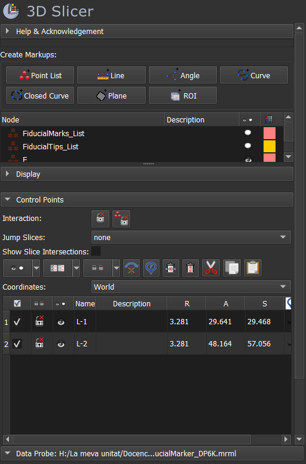
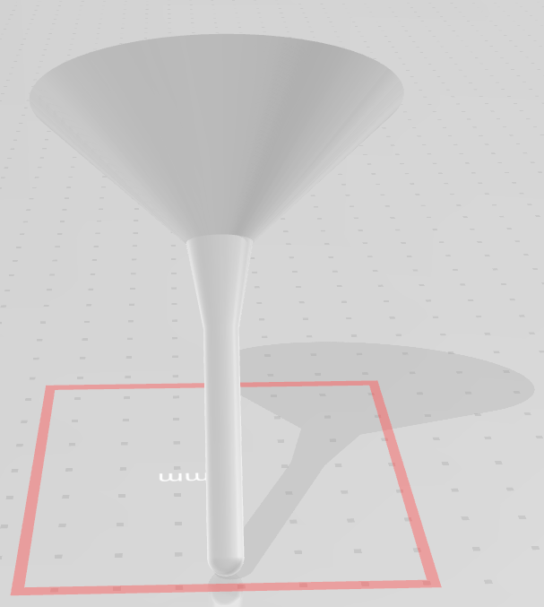
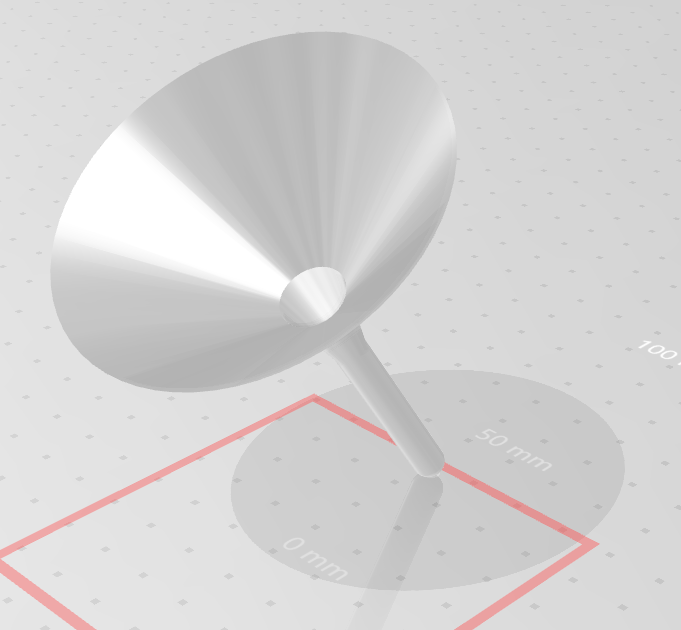
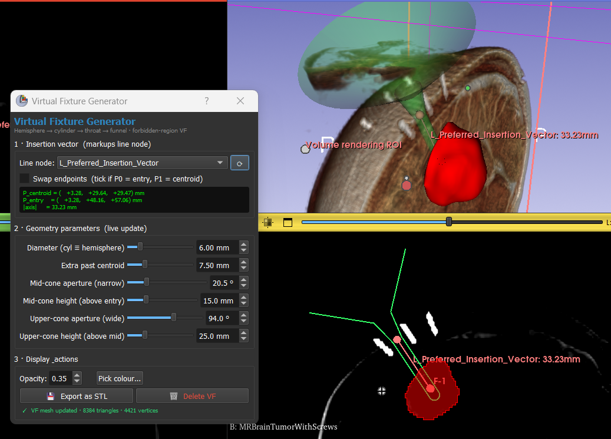

# Module 04 · Virtual Fixture Protection

This module generates an interactive **Virtual Fixture (VF)** in 3D Slicer that
acts as a *forbidden-region constraint* during robotic stereotactic brain
biopsy: the biopsy tool tip must remain **inside** the surface, and the
surface itself is the no-fly boundary the robot controller enforces. The
shape couples a deep hemispherical bound around the target with a tight
cylindrical channel along the planned insertion axis and a two-stage funnel
above the skin — narrow first, to clear the fiducial-screw heads ringed
around the entry point, then wide, for tool ergonomics.

The script is interactive: every parameter updates the mesh in real time, and
moving either endpoint of the insertion line repositions and re-orients the
VF immediately.

---

## Prerequisites

Before running this module the upstream pipeline of the project must already
have produced, in the current Slicer scene:

1. **A segmented tumour** (output of *Module 03 · Slicer Segmentation*).
2. **An insertion-vector markups line** with exactly two control points,
   defined as a **segment** between
   - **point 0 — the tumour centroid** (deep end), and
   - **point 1 — a point on the cranium surface** (entry, shallow end).

   This segment is the geometric input that fully determines the VF's
   position and orientation. The figure below shows the expected layout in
   the scene:

   

   If your line was drawn in the opposite order (entry first, then centroid)
   the GUI offers a **Swap endpoints** toggle, so you do not need to redraw
   it.

The example scene in `data/` already contains a line node named
`L_Preferred_Insertion_Vector` with this convention.

---

## Geometry of the Virtual Fixture

The VF is a closed surface of revolution around the insertion axis,
assembled from four primitives in the local frame `(+Z = insertion axis,
origin at the hemisphere centre)`:

| # | Part         | Local Z range                                     | Role                                             |
|---|--------------|---------------------------------------------------|--------------------------------------------------|
| 1 | Hemisphere   | `[ −r          , 0 ]`                             | Caps the deep end around the tumour.             |
| 2 | Cylinder     | `[ 0           , L_cyl ]`                         | Constrains the tool along the insertion axis.    |
| 3 | Mid-cone     | `[ L_cyl       , L_cyl + h_mid ]`                 | Narrow throat clearing the fiducial screws.      |
| 4 | Upper-cone   | `[ L_cyl + h_mid , L_cyl + h_mid + h_top ]`       | Wide funnel for tool ergonomics above the skin.  |

The cylinder length is computed automatically so that the **top of the
cylinder coincides exactly with the cranium entry point**:

```
L_cyl = ‖P_entry − P_centroid‖ − r + Δ
```

where `r` is the common radius of the hemisphere and cylinder and `Δ` is the
*Extra past centroid* margin that determines how far the dome extends past
the tumour centroid.

The two convex corners (cylinder ↔ mid-cone, mid-cone ↔ upper-cone) can be
optionally smoothed with **tangent-continuous circular fillets** of
user-set radius. Setting both fillet radii to zero reproduces the sharp
piecewise-conical silhouette.

The two views below are renders of the resulting model exported as STL,
showing the full VF in the same orientation as it would sit on the patient:

| Front view                                        | Perspective view                                  |
|---------------------------------------------------|---------------------------------------------------|
|         |        |

The narrow throat between the cylinder and the wide funnel is the
distinguishing feature of this design: it adds the radial clearance needed
for the 4 mm-tall fiducial screws *without* widening the channel near the
brain surface, where the tool path must remain tight.

---

## Using the GUI

Open the script in Slicer's Python Console (`Ctrl+3`):

```python
exec(open(r"…/04_VirtualFixture_Protection/scripts/virtual_fixture_generator.py").read())
```

A floating panel appears alongside the 3D view. Slicer's standard slice and
3D views remain interactive while the panel is open, so you can rotate,
scroll, and adjust the VF in parallel.



The panel is organised in three sections:

**1 · Insertion vector.** Pick the markups line that defines the trajectory.
The dropdown lists every `vtkMRMLMarkupsLineNode` currently in the scene; the
refresh button (⟳) re-scans the scene if you have just created or deleted a
line. The endpoint coordinates and the axis length are echoed in the green
read-out so you can verify the orientation is what you expect. If the order
of points is reversed, tick *Swap endpoints*.

**2 · Geometry parameters.** Eight live sliders drive the mesh:
*Diameter* (cylinder ≡ hemisphere), *Extra past centroid*, *Mid-cone
aperture* and *height*, *Upper-cone aperture* and *height*, and the two
fillet radii at the cyl ↔ mid and mid ↔ upper junctions. Any change rebuilds
the mesh immediately; the status line at the bottom of the panel reports the
new triangle and vertex counts and warns if the parameters produce a
degenerate geometry (for example, a fillet that would not fit on its
surrounding segment).

**3 · Display & actions.** Adjust the model's opacity and colour, export
the current mesh to **STL** for downstream use (e.g., the Unity simulator in
later modules), or remove the VF from the scene.

The VF is a single MRML model node named `VirtualFixture`. Re-running the
script reuses the same node rather than creating duplicates, so the
undo-history stays clean during interactive tuning.

---

## Folder structure

```
04_VirtualFixture_Protection/
├── README.md
├── scripts/
│   └── virtual_fixture_generator.py     ← run from the Slicer Python Console
├── data/
│   └── *.mrb                             ← example Slicer scene with screws,
│                                            tumour segmentation, and the
│                                            preferred insertion-vector line
└── images/
    ├── ExportedVF_01.png
    ├── ExportedVF_02.png
    ├── VF_GUI.png
    └── FiducialMarkers_Segment.png
```

The `data/` subfolder ships a complete example scene so the module can be
tested in isolation, without rerunning the full upstream pipeline.

---

## Author

**Albert Hernansanz Prats**
*albert.hernansanz@upf.edu · alberthp@gmail.com*
SYMBIOsis | Barcelona Centre for New Medical Technologies (BCN MedTech)
Department of Information and Communication Technologies
Universitat Pompeu Fabra (UPF)