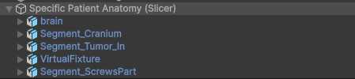
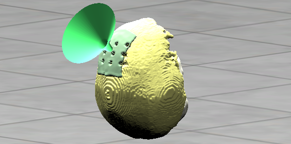
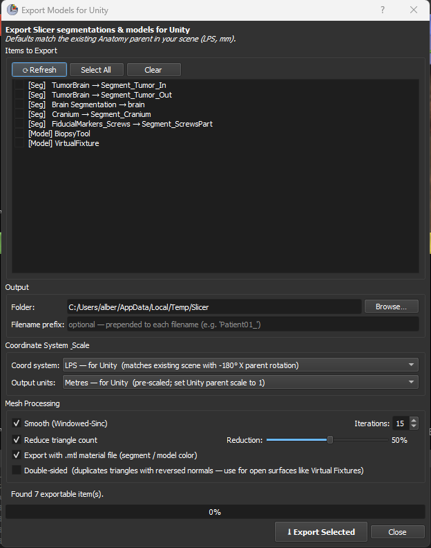

# Module 05 — Slicer to Unity 3D Export

> Exporting segmented anatomical structures from 3D Slicer as Unity-ready OBJ meshes — handling coordinate system conversion, unit scaling, smoothing, decimation, and material colours in a single non-blocking GUI tool.

---

## 📌 Purpose

This module bridges the medical imaging world (3D Slicer, RAS coordinates, millimetres) and the surgical simulation world (Unity, left-handed Y-up, metres). It takes the segmented structures produced by Modules 01–03 and exports them as clean, aligned OBJ files that can be imported directly into the Unity simulator.

A naive export from Slicer produces meshes that are in the wrong coordinate system, wrong units, unsmoothed, excessively dense, and untextured. The exporter script solves all five problems in one click.

---

## 🎯 What this module produces

For each selected segment or model, the exporter writes an OBJ + MTL pair:

```
output_folder/
├── brain.obj                 ← LPS coords, metres, smoothed, decimated
├── brain.mtl                 ← material colour from Slicer segment
├── Segment_Cranium.obj
├── Segment_Cranium.mtl
├── Segment_Tumor_In.obj
├── Segment_Tumor_In.mtl
├── VirtualFixture.obj        ← exported with Double-sided option
├── VirtualFixture.mtl
└── Segment_ScrewsPart.obj
```

These files import directly into Unity and align correctly when placed under a single parent transform.

---

## 📁 Folder structure

```
05_Slicer2Unity_3DExport/
├── README.md                            ← this file
├── data/
│   └── (sample Slicer scene or exported OBJs)
├── images/
│   ├── exporter_gui.png                 ← screenshot of the export dialog
│   ├── unity_hierarchy.png              ← Unity hierarchy after import
│   ├── unity_anatomy.png                ← 3D view of imported anatomy in Unity
│   ├── coordinate_systems.png           ← RAS vs LPS vs Unity diagram
│   └── unity_import_result.png          ← final scene with robot + anatomy
└── scripts/
    └── unity_segmentation_exporter.py   ← the export tool
```

---

## 🛠 Prerequisites

| Component | Version | Notes |
|---|---|---|
| 3D Slicer | ≥ 5.6.0 | Tested on 5.10.0 |
| Python | Bundled with Slicer | Uses VTK + PythonQt only, no extra packages |
| Unity | ≥ 2021.3 LTS | For the receiving side |
| Modules 01–03 | Completed | Segmentations and models must exist in the scene |

---

## 🚀 Quick Start

### Step 1 — Export from Slicer

1. Open the Slicer scene with all segmentations loaded (output of Module 03).

2. Open the Python Console: `Ctrl + 3`.

3. Run the exporter:

   ```python
   exec(open(r"F:\RoboticStereotacticBrainBiopsy\05_Slicer2Unity_3DExport\scripts\unity_segmentation_exporter.py").read())
   ```

4. The non-blocking dialog opens. Slicer remains fully interactive.

5. Select items, set the output folder, and click **⤓ Export Selected**.

   > For the Virtual Fixture, tick the **Double-sided** checkbox — this duplicates triangles with reversed normals so both faces render correctly in Unity (see the [Mesh Processing](#4-mesh-processing) section).

### Step 2 — Import into Unity

1. Copy all `.obj` and `.mtl` files into your Unity project (e.g. `Assets/Models/Anatomy/`).

2. Unity auto-imports them and creates Material assets from the `.mtl` files.

3. Create an **empty parent GameObject** (e.g. `Specific Patient Anatomy (Slicer)`) to hold all the anatomy parts.

4. Drag each imported model into the scene as a child of this parent.

5. Set the parent transform to align the LPS-metre meshes with your Unity scene:

   | Property | Value | Why |
   |---|---|---|
   | Position | Adjust to place anatomy on the OR table | Scene-dependent |
   | Rotation | (-180°, 0°, 0°) | Converts LPS → Unity Y-up |
   | Scale | (1, 1, 1) | Meshes are already in metres |

6. All child meshes share the same coordinate space (no per-child transforms needed):

   

   ```
   Specific Patient Anatomy (Slicer)     ← parent with Rotation(-180, 0, 0)
     ├── brain
     ├── Segment_Cranium
     ├── Segment_Tumor_In
     ├── VirtualFixture
     └── Segment_ScrewsPart
   ```

   Because all meshes were exported in world-RAS space and then converted to LPS metres, they are **mutually aligned**. A single parent transform positions the entire anatomy in the simulation workspace.

   The final result in Unity's 3D view — cranium (yellow), virtual fixture corridor (green, double-sided), screw fiducials, and tumour, all aligned under a single parent transform:

   

---

## 🧭 The Coordinate System Problem

The most common source of bugs when bridging Slicer and Unity is the coordinate system mismatch:

| Property | 3D Slicer (RAS) | Unity (Y-up LHS) |
|---|---|---|
| X axis | Right (+R) | Right |
| Y axis | Anterior (+A) | **Up** |
| Z axis | Superior (+S) | Forward |
| Units | Millimetres | Metres |
| Up direction | +S (Z) | +Y |

### LPS as the bridge convention

Slicer can export in **LPS** (Left-Posterior-Superior, the DICOM convention), which negates both X and Y relative to RAS. When combined with a Unity parent rotation of (-180°, 0, 0), the axes align correctly:

```
Slicer RAS (mm)
    ↓   export script: negate X, negate Y  (RAS → LPS)
    ↓   export script: × 0.001             (mm → m)
LPS (metres)
    ↓   Unity parent: Rotation(-180°, 0, 0)
    ↓   flips Y and Z → aligns with Unity Y-up
Unity world (metres, Y-up)
```

> **Important:** if you export in metres (the default), the Unity parent scale should be **(1, 1, 1)**. If you export in millimetres, the parent scale must be **(0.001, 0.001, 0.001)**.

---

## 📸 Exporter GUI Walkthrough



The dialog is divided into five sections, from top to bottom:

### 1. Items to Export

A checkable list of every exportable item found in the Slicer scene:

- **[Seg]** — individual segments inside `vtkMRMLSegmentationNode` instances (e.g. `TumorBrain → Segment_Tumor_In`).
- **[Model]** — stand-alone `vtkMRMLModelNode` instances (e.g. `VirtualFixture`, `BiopsyTool`).

Slicer's internal slice display models are filtered out automatically.

Toolbar buttons: **⟳ Refresh** rescans the scene, **Select All** checks everything, **Clear** unchecks everything.

### 2. Output

- **Folder** — destination for the exported files. Use **Browse…** to pick the folder (e.g. your Unity project's `Assets/Models/Anatomy/`).
- **Filename prefix** — optional string prepended to every filename (e.g. `Patient01_` produces `Patient01_brain.obj`).

### 3. Coordinate System & Scale

| Option | Default | When to use |
|---|---|---|
| **LPS — for Unity** | ✓ | Standard Unity import with a parent Rotation(-180°, 0, 0). |
| RAS — for Slicer | | Re-importing into Slicer or other medical tools. |
| **Metres — for Unity** | ✓ | Unity's native unit. Parent scale = (1, 1, 1). |
| Millimetres — for Slicer | | When the Unity parent has scale (0.001, 0.001, 0.001). |

Both defaults are pre-set for Unity import. No changes needed for the standard workflow.

### 4. Mesh Processing

| Option | Default | Effect |
|---|---|---|
| **Smooth (Windowed-Sinc)** | ON, 15 iterations | Removes marching-cubes stair-stepping. Volume-preserving — won't shrink the mesh. |
| **Reduce triangle count** | ON, 50% | Halves the triangle count via quadric decimation. Quality loss is typically invisible on smooth anatomical surfaces. |
| **Export with .mtl** | ON | Writes a material file carrying the Slicer segment colour. Unity auto-creates a Material asset on import. |
| **Double-sided** | OFF | Duplicates all triangles with reversed normals. **Enable this for open surfaces** like Virtual Fixtures, where both faces of the mesh must be visible. Leave it OFF for closed surfaces (skull, brain, tumour). |

Processing order: Smoothing → Decimation → LPS axis conversion → Scale → Recompute normals → (optional) Double-sided duplication.

### 5. Status & Progress

A progress bar and per-item status line updated live during export. Errors are collected and displayed at the end without aborting the run. The Slicer console also prints bounding-box diagnostics for each item:

```
  ✓ [segment] Cranium          centre=( -1.2, +28.4, +45.3) mm   span=(152 × 178 × 140)
  ✓ [segment] TumorIn          centre=(+12.1, +33.8, +52.1) mm   span=(38 × 36 × 32)
  ✓ [model]   VirtualFixture   centre=(+10.5, +35.2, +55.0) mm   span=(45 × 42 × 60)
```

If all centres are close together (within the skull volume), the meshes are aligned. If one is at (0, 0, 0) or far off, its parent transform was not baked correctly.

---

## 🔧 How it works under the hood

### World-space extraction

Every segment and model is extracted in **world RAS coordinates** before any export conversion. This is critical for alignment:

**Segments** are extracted using Slicer's `ExportSegmentsToModels()` API, which correctly handles the full transform chain: segmentation reference image geometry (origin, spacing, directions) plus any parent MRML transforms (e.g. registration transforms from Module 02). A fallback path using `vtkGeneralTransform` handles edge cases.

**Models** (like VirtualFixture) are extracted with `vtkGeneralTransform` via `GetTransformBetweenNodes(parent, None)`, which resolves linear, non-linear, and concatenated transform chains to world space.

### Non-blocking export

Long-running VTK pipelines (smoothing, decimation) would freeze Slicer if run synchronously. The exporter uses a `QTimer.singleShot`-driven queue: each item processes in a separate event-loop tick, yielding control between steps so the UI stays responsive.

### Double-sided mesh generation

When enabled, the exporter uses `vtkReverseSense` to create a copy of the mesh with flipped triangle winding and inverted normals, then `vtkAppendPolyData` to merge original + reversed into one mesh. Unity's Standard shader (which culls back faces by default) then renders both sides without requiring a custom shader.

### Material export

The `.mtl` file uses the segment or model colour from Slicer:

```
newmtl Cranium
Ka 0.831 0.745 0.659
Kd 0.831 0.745 0.659
Ks 0.200 0.200 0.200
Ns 20.000
d 1.000
illum 2
```

Unity's OBJ importer reads `Kd` as the albedo colour and auto-generates a Material asset.

---

## 🐛 Troubleshooting

| Symptom | Cause | Fix |
|---|---|---|
| Meshes misaligned in Unity (one part offset from others) | Parent MRML transforms not baked into vertices. | Use the latest script version — it uses `ExportSegmentsToModels` and `vtkGeneralTransform` for robust world-space baking. Check console output: all centres should be in the same neighbourhood. |
| Virtual Fixture invisible from inside | Single-sided triangles; back faces culled. | Re-export with **Double-sided** checked. |
| Model appears mirrored in Unity | Exported in RAS instead of LPS. | Re-export with **LPS — for Unity** selected. |
| Model 1000× too small or too large | Scale/unit mismatch between export and Unity parent. | If parent scale = (1,1,1), export in **Metres**. If parent scale = (0.001), export in **Millimetres**. |
| Model below/behind the anatomy | Unity parent missing Rotation(-180°, 0, 0). | Set the parent rotation to (-180, 0, 0). |
| `.mtl` colour not applied in Unity | OBJ and MTL files separated into different folders. | Keep both in the same folder; Unity looks for the MTL next to the OBJ. |
| Decimated mesh has holes | Aggressive reduction (>90%) on a thin surface. | Lower the reduction slider and re-export. |
| Slicer crashes when clicking items | Older script versions used an unstable PythonQt pattern. | Use the latest script — selection uses `MultiSelection` mode with payloads in a parallel list. |
| Exported segment is empty | Closed surface representation never generated. | In Slicer, open Segment Editor → click "Show 3D" to prime the representation, then re-export. |

---

## 🔗 Connection to the rest of the pipeline

```
   ┌───────────────────────────┐
   │ Module 01: Fiducial       │
   │  screws simulation        │
   └──────────┬────────────────┘
              ↓
   ┌───────────────────────────┐
   │ Module 02: MRI → CT       │
   │  conversion + registration│
   └──────────┬────────────────┘
              ↓
   ┌───────────────────────────┐
   │ Module 03: Segmentation   │
   │  + screw detection        │
   └──────────┬────────────────┘
              ↓
  ╔═══════════════════════════════╗
  ║ Module 05: Slicer → Unity    ║  ← THIS MODULE
  ║  3D mesh export              ║
  ╚═══════════╤═══════════════════╝
              ↓
   ┌───────────────────────────┐
   │ Module 04: OpenIGT        │
   │  real-time tracking       │
   └──────────┬────────────────┘
              ↓
   ┌───────────────────────────┐
   │ Module 06: Unity haptic   │
   │  surgical simulator       │
   └──────────┬────────────────┘
              ↓
   ┌───────────────────────────┐
   │ Module 07: Unity AR       │
   └───────────────────────────┘
```

---

## 📚 References

- Garland, M. & Heckbert, P. (1997). *Surface Simplification Using Quadric Error Metrics.* SIGGRAPH '97 — basis of `vtkQuadricDecimation`.
- Taubin, G. (1995). *Curve and surface smoothing without shrinkage.* ICCV '95 — basis of `vtkWindowedSincPolyDataFilter`.
- DICOM Standard, PS3.3 Section C.7.6.2.1.1 — patient coordinate system (LPS) definition.
- 3D Slicer documentation, [Coordinate systems](https://slicer.readthedocs.io/en/latest/user_guide/coordinate_systems.html).
- Wavefront OBJ + MTL specification, [Paul Bourke's reference](http://paulbourke.net/dataformats/obj/).

---

## 🪪 License & attribution

Part of the [RoboticStereotacticBrainBiopsy](https://github.com/alberthp/RoboticStereotacticBrainBiopsy) educational project, developed for the bioengineering course at Universitat Pompeu Fabra (UPF).
