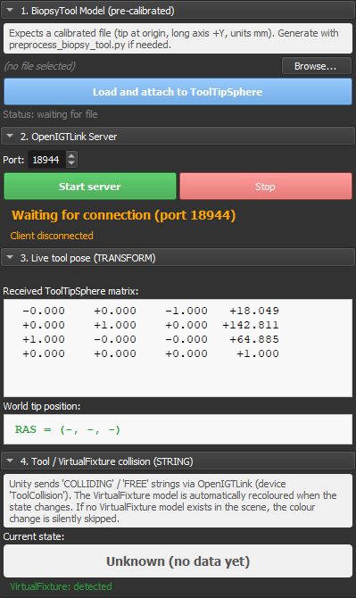

# Module 04 — Slicer ↔ Unity OpenIGTLink Bridge

This module establishes the real-time bridge between **3D Slicer**
(medical image processing, anatomical context, virtual fixtures) and
**Unity** (interactive surgical simulator) for the robotic
stereotactic brain biopsy educational project.

The bridge is implemented as a **Slicer Scripted Loadable Module**
(name: *BiopsyTool OpenIGT Bridge*, category: *IGT*) that consolidates
the entire runtime setup: loading the pre-calibrated tool model,
starting the OpenIGTLink server, displaying the live tool pose, and
visualising the collision state between the tool and the planned
virtual fixture.



*The BiopsyTool OpenIGT Bridge panel as it appears inside Slicer (left-hand Modules area). The four collapsible sections cover the full runtime workflow: loading the calibrated tool model, starting the OpenIGTLink server, monitoring the live tool pose, and visualising the collision state. See [GUI overview](#gui-overview) below for a per-section walkthrough.*

## Table of Contents

1. [About OpenIGTLink](#about-openigtlink)
2. [GUI overview](#gui-overview)
3. [Architecture](#architecture)
4. [Repository Layout](#repository-layout)
5. [Prerequisites](#prerequisites)
6. [Installing the Slicer extension](#installing-the-slicer-extension)
   - [Quick path: drop-in Python script](#quick-path-drop-in-python-script)
   - [Full extension: load via Slicer](#full-extension-load-via-slicer)
   - [Packaged distribution (.s4ext)](#packaged-distribution-s4ext)
7. [Setup, step by step](#setup-step-by-step)
8. [Coordinate systems and calibration](#coordinate-systems-and-calibration)
9. [OpenIGTLink message reference](#openigtlink-message-reference)
10. [Collision detection](#collision-detection)
11. [Troubleshooting](#troubleshooting)
12. [Appendix: Manual setup without the extension](#appendix-manual-setup-without-the-extension)
13. [Credits and educational context](#credits-and-educational-context)

---

## About OpenIGTLink

**OpenIGTLink** (Open Image-Guided Therapy Link) is a lightweight,
open-source network protocol designed for real-time communication
between medical image processing software, surgical navigation
systems, and external devices such as tracking sensors, robots, or
simulators. It runs over TCP/IP and defines a small set of typed
message structures (TRANSFORM, IMAGE, STRING, POINT, …) tailored to
the needs of image-guided therapy.

The protocol is the de facto standard for inter-application messaging
in the surgical-navigation research community and is supported
natively by 3D Slicer (via the SlicerOpenIGTLink extension) and by
many other open and commercial platforms. In this project it is the
glue that lets Unity push live simulated tool poses into Slicer's
anatomical reference frame at interactive rates, and lets Slicer
react to discrete events such as virtual-fixture collisions.

---

## GUI overview

The module exposes four collapsible sections, each grouping a logical
step of the workflow. The screenshot at the top of this README shows
all four in their typical post-setup state. Here is what each one
does:

### Section 1 — BiopsyTool Model (pre-calibrated)

File-picker row plus a single big **Load and attach to ToolTipSphere**
button. The label underneath shows whether the file is ready, loaded
successfully, or reports an error (with the failing reason).

When this section is "green / OK", you have a `BiopsyTool` model node
in the scene parented to a `ToolTipSphere` transform node.

### Section 2 — OpenIGTLink Server

Port spinner (default `18944`) plus the **Start server** / **Stop**
buttons. The two status lines underneath are kept in sync with the
underlying connector:

| Line shown | Meaning |
|---|---|
| `Stopped` (gray) | The server is not listening. |
| `Waiting for connection (port N)` (orange) | The server is up but no client has connected yet. |
| `Active and connected (port N)` (green) | Unity is connected. Messages are flowing. |
| `Client connected` (green) / `Client disconnected` (orange) | Edge-detected transitions; useful for spotting accidental drops. |

### Section 3 — Live tool pose (TRANSFORM)

The 4×4 matrix received from Unity for the `ToolTipSphere` device,
plus the **world-space tip position** in RAS millimetres computed
from it. An "Updates received" counter increments on every distinct
matrix received (matrices identical to the previous one are de-duped
to keep the counter meaningful).

This is the section that confirms the TRANSFORM message stream is
healthy. If the counter is stuck at zero while the server says
"Active and connected", the Unity client is sending nothing or
sending under a different device name.

### Section 4 — Tool / VirtualFixture collision (STRING)

The current value of the collision state coming from Unity as an
OpenIGTLink STRING message addressed to the `ToolCollision` device.
Three possible visual states:

| Label | Background | Meaning |
|---|---|---|
| `Unknown (no data yet)` | gray | No STRING has been received since the server started. |
| `[OK] FREE` | green | Unity says the tool is outside the VirtualFixture trigger. |
| `[!] COLLISION` | red | Unity says the tool is intersecting the VirtualFixture trigger. |

The small footer line shows whether a model node named `VirtualFixture`
exists in the scene. If it does, the module automatically recolours
that model red on COLLISION and restores its original colour on
FREE. If it doesn't, the status label still updates but no model
recolouring happens — the module never crashes when the scene lacks
a VirtualFixture.

---

## Architecture

```
+--------------------------+        OpenIGTLink TCP        +--------------------------+
|         SLICER           |  <-- TRANSFORM (50+ Hz)  --   |          UNITY           |
|        (server)          |  -- STRING (event-based) -->  |        (client)          |
|        port 18944        |                               |                          |
|--------------------------|                               |--------------------------|
|  ToolTipSphere           |  <-- 4x4 matrix RAS pose     |  BiopsyTool GameObject   |
|     |                    |                               |  with collider           |
|     +-- BiopsyTool       |                               |     |                    |
|                          |                               |     +-- IGTLClient       |
|  ToolCollision (text)    |  --> "COLLIDING" / "FREE"     |                          |
|     |                    |                               |  VirtualFixture          |
|     +--> recolors        |                               |  trigger volume          |
|         VirtualFixture   |                               |                          |
+--------------------------+                               +--------------------------+
```

- **Slicer acts as the server**: it owns the anatomical reference
  frame and the planned virtual fixture. It listens for incoming
  data from Unity.
- **Unity acts as the client**: it owns the simulated robotic
  manipulation. It pushes the live tool pose and collision events to
  Slicer.

---

## Repository Layout

```
RoboticStereotacticBrainBiopsy/
├── data/
│   ├── BiopsyTool.stl              # original, raw, in metres
│   ├── BiopsyTool_ready.stl        # pre-calibrated (mm, tip at origin, axis +Y)
│   └── scene.mrb                   # Slicer scene with MRI, segmentations, fiducials, VF
├── scripts/
│   ├── preprocess_biopsy_tool.py   # one-time: BiopsyTool.stl -> BiopsyTool_ready.stl
│   └── BiopsyToolOpenIGT/          # the Slicer extension lives here
│       ├── README.md               # this document
│       ├── CMakeLists.txt          # extension-level (Wizard-generated)
│       ├── BiopsyToolOpenIGT.png   # extension icon
│       ├── LICENSE.txt
│       └── BiopsyToolOpenIGT/      # the module itself
│           ├── CMakeLists.txt      # module-level
│           ├── BiopsyToolOpenIGT.py   # ← the actual module code
│           ├── Resources/
│           │   ├── Icons/
│           │   └── UI/
│           └── Testing/
│               └── Python/
└── 04_OpenIGT_Communication/
    └── images/
        ├── gui_screenshot.png
        ├── slicer_unity_synced.png
        └── collision_color.png
```

### File responsibilities

| File | Type | Generated by | Committed to repo? |
|---|---|---|---|
| `BiopsyTool.stl` | Raw model | Original CAD export | ✓ Yes (reference) |
| `BiopsyTool_ready.stl` | Calibrated model | `preprocess_biopsy_tool.py` | ✓ Yes (final asset) |
| `preprocess_biopsy_tool.py` | One-time script | Hand-written | ✓ Yes |
| `BiopsyToolOpenIGT/` extension folder | Slicer scripted module | Slicer Extension Wizard + hand edits | ✓ Yes |
| `scene.mrb` | Slicer scene | Modules 01–03 | ✓ Yes |

---

## Prerequisites

| Component | Version tested | Notes |
|---|---|---|
| 3D Slicer | 5.10.0 | Older 5.x should also work |
| SlicerOpenIGTLink extension | latest stable | Install via Extensions Manager |
| Unity | 2022 LTS or later | Standalone Windows / macOS build |
| openigtnet (Unity C# library) | latest | Drop-in `.dll` or via package |
| Python with VTK | 3.9+ | Only for the preprocessing step |

Both Slicer and Unity should run on the **same machine** for the
default `localhost:18944` configuration. Cross-machine connections
work but require firewall configuration.

---

## Installing the Slicer extension

The `BiopsyToolOpenIGT/` folder in this repository is a fully-formed
Slicer extension. Depending on your needs, you have **three different
ways** to use it:

| If you want to... | Go to |
|---|---|
| Just run the module quickly without dealing with extension paths | [Quick path: drop-in Python script](#quick-path-drop-in-python-script) |
| Load the full extension structure as Slicer expects it | [Full extension: load via Slicer](#full-extension-load-via-slicer) |
| Distribute the extension to other Slicer users via Extensions Manager | [Packaged distribution (.s4ext)](#packaged-distribution-s4ext) |

---

### Quick path: drop-in Python script

If you don't need the full extension structure and just want to run
the module locally:

1. Download the standalone Python file directly from GitHub:
   ```
   https://raw.githubusercontent.com/alberthp/RoboticStereotacticBrainBiopsy/main/scripts/BiopsyToolOpenIGT/BiopsyToolOpenIGT/BiopsyToolOpenIGT.py
   ```
   (Right-click → Save link as → save it anywhere on your machine.)
2. Place it in any folder, e.g. `C:\SlicerModules\BiopsyToolOpenIGT\`
   (the folder name doesn't matter, but the file MUST stay named
   `BiopsyToolOpenIGT.py`).
3. Open Slicer → **Edit → Application Settings → Modules**.
4. Under **Additional module paths**, click **Add** and select the
   folder containing `BiopsyToolOpenIGT.py`.
5. Restart Slicer.
6. The module appears under **Modules → IGT → BiopsyTool OpenIGT
   Bridge**.

This approach gives you the module without any of the surrounding
extension scaffolding (no `CMakeLists.txt`, no icon, no testing
folder). It is the minimum needed to run the module.

> **Limitation**: with the drop-in approach you lose the ability to
> use the Extension Wizard's "Reload Module" feature, which is useful
> when iterating on the code. For active development, prefer the
> full extension structure below.

---

### Full extension: load via Slicer

This is the recommended approach if you cloned (or downloaded) the
entire repository.

#### Step 1: understand the extension folder structure

A Slicer scripted extension has a strict on-disk layout. The
Extension Wizard generates this layout automatically; you only ever
edit the `.py` file inside it. The structure looks like:

```
BiopsyToolOpenIGT/                     ← extension root (top level)
│
├── CMakeLists.txt                     ← extension-level CMake (metadata:
│                                        name, category, homepage, etc.)
├── BiopsyToolOpenIGT.png              ← 128x128 extension icon
├── LICENSE.txt                        ← MIT licence text
│
└── BiopsyToolOpenIGT/                 ← module root (same name!)
    │
    ├── CMakeLists.txt                 ← module-level CMake (just registers
    │                                    the .py with Slicer's build system)
    ├── BiopsyToolOpenIGT.py           ← ← ← THE MODULE CODE
    │
    ├── Resources/                     ← optional UI assets
    │   ├── Icons/
    │   │   └── BiopsyToolOpenIGT.png  ← 24x24 toolbar icon
    │   └── UI/                        ← .ui XML files (not used in this
    │                                    module: we build the GUI in code)
    │
    └── Testing/                       ← Python unit-tests
        └── Python/
            ├── CMakeLists.txt
            └── BiopsyToolOpenIGTModuleTest.py
```

Key points:

- The **double-nested folder name** (`BiopsyToolOpenIGT/BiopsyToolOpenIGT/`)
  is not a typo: Slicer's convention is that the outer folder is
  the **extension** and the inner folder is the **module** inside
  it. A single extension can host multiple modules — each one would
  be a sibling subfolder next to `BiopsyToolOpenIGT/` here.
- The `.py` filename and the `class BiopsyToolOpenIGT` at the top of
  it MUST match exactly. Renaming one without the other breaks the
  module.
- Everything outside `BiopsyToolOpenIGT.py` is optional scaffolding
  that becomes relevant only when you package the extension for
  redistribution. For day-to-day use the module runs from the `.py`
  alone.

#### Step 2: install the Extension Wizard (one-time)

The Extension Wizard ships in the **DeveloperToolsForExtensions**
add-on, which is the official tool for loading extensions from disk.

1. Open Slicer.
2. Click the **Extensions Manager** icon (the package icon in the
   toolbar) or go to **View → Extensions Manager**.
3. Pick the **Install Extensions** tab.
4. In the search bar type **"Developer Tools"**.
5. Find **DeveloperToolsForExtensions**, click **Install**.
6. Restart Slicer when prompted.

After the restart the Wizard appears under
**Modules → Developer Tools → Extension Wizard**.

#### Step 3: load the extension into Slicer

With the Wizard installed:

1. Navigate to **Modules → Developer Tools → Extension Wizard**.
2. In the Wizard panel, click the green **Select Extension** button.
3. A file dialog opens. Browse to the **extension root folder**:
   ```
   <repo>/scripts/BiopsyToolOpenIGT/
   ```
   (the folder that contains the *top-level* `CMakeLists.txt` and
   the inner `BiopsyToolOpenIGT/` subfolder — NOT the inner folder
   itself).
4. Click **Select Folder**.
5. The Wizard reads the extension, displays its metadata
   (`BiopsyToolOpenIGT`, category `IGT`, etc.) in the **Extension
   Editor** panel, and lists `BiopsyToolOpenIGT` under "Contents".
6. Slicer asks: *"This extension contains modules. Do you want to
   load them now?"* → click **Yes**.
7. If Slicer prompts to restart, do so.
8. The module now appears at **Modules → IGT → BiopsyTool OpenIGT
   Bridge**. Select it: the panel with the four sections (Model /
   Server / Live tool pose / Collision) should appear.

#### Step 4 (optional): rapid iteration with Reload Module

If you plan to modify the code:

1. Edit `BiopsyToolOpenIGT.py` in your editor of choice.
2. Save.
3. In Slicer, while the BiopsyTool OpenIGT Bridge module is the
   active one, press **`Ctrl+R`** (or, in the Extension Wizard,
   click **Reload Module**).
4. The module rebuilds from disk in seconds. No restart needed.

This is the main reason to prefer the full extension structure over
the drop-in script approach.

---

### Packaged distribution (.s4ext)

Once the project is stable enough to share with users who don't
have access to the repository, you can build a single `.s4ext`
package that ships through Slicer's Extensions Manager.

This requires either:
- Building Slicer from source and pointing CMake at the extension
  root folder, **or**
- Using the [SlicerCustomAppTemplate](https://github.com/KitwareMedical/SlicerCustomAppTemplate)
  build pipeline.

See the [official Slicer extension tutorial](https://slicer.readthedocs.io/en/latest/developer_guide/extensions.html)
for the full process.

This option is out of scope for the educational project at its
current stage, but the folder layout described above is already
compatible — no restructuring will be needed when the time comes.

---

## Setup, step by step

> **Heads up**: this section assumes the extension has been
> installed via one of the three routes described above. If you
> haven't done that yet, do it first.

### Step 1 — Prepare the BiopsyTool model (one-time)

The raw `BiopsyTool.stl` is in metres with the tip located at
`(0, +0.1118, 0)` (long axis along **+Y**, tip at the positive-Y
end). Unity expects the tool's local origin at the tip and its long
axis along **+Y** in millimetres.

The `preprocess_biopsy_tool.py` script bakes the required
transformation into a new STL file:

```
| 1000     0      0      0     |  <-- X scaled  x1000
|    0 -1000      0   +111.8   |  <-- Y flipped, scaled, translated
|    0     0   1000      0     |  <-- Z scaled  x1000
|    0     0      0      1     |
```

Execute this script **once** in Slicer's Python Console (`Ctrl+3`):

```python
exec(open(r"F:\RoboticStereotacticBrainBiopsy\scripts\preprocess_biopsy_tool.py").read())
```

You should see output similar to:

```
INPUT  (574 pts):
  X: [-0.0305, +0.0305]  (m)
  Y: [-0.0025, +0.1118]  (m, tip at +Y)
  Z: [-0.0303, +0.0303]  (m)

OUTPUT (574 pts):
  X: [-30.48, +30.48]  (mm)
  Y: [+0.03, +114.30]  (mm, tip at Y~0, disc at Y~+111.8)
  Z: [-30.31, +30.31]  (mm)
```

Commit the resulting `BiopsyTool_ready.stl` to `data/` and end users
only need this file from now on.

### Step 2 — Open the Slicer scene

The Slicer scene should already contain the outputs of Modules 01–03:

- Patient MRI (or MRI→CT registered volume)
- `FiducialMarks_List` (pink, on-skull base points)
- `FiducialTips_List` (yellow, screw tips)
- Segmentation models: `Cranium`, `Brain`, `Tumor`
- `VirtualFixture` model (planned no-go region for the tool)

Open the scene normally via `File → Add Data` or by loading the
`.mrb` file from `data/scene.mrb`.

> **Note**: the scene should **not** contain any runtime nodes like
> `BiopsyTool`, `IGTLServer`, or live transforms. Those are created
> on demand by the module. The scene file is for static anatomical
> data only.

### Step 3 — Open the module and load the tool

1. From the module drop-down at the top of Slicer, navigate to
   **IGT → BiopsyTool OpenIGT Bridge**.
2. The panel shows four collapsible sections (see the screenshot
   at the top of this README and the
   [GUI overview](#gui-overview) for a per-section walkthrough):
   1. BiopsyTool Model (pre-calibrated)
   2. OpenIGTLink Server
   3. Live tool pose (TRANSFORM)
   4. Tool / VirtualFixture collision (STRING)
3. In **Section 1**: the path field may already be pre-filled if a
   `BiopsyTool_ready.stl` is found in the project layout. Otherwise
   click **Browse...** and select it.
4. Click **Load and attach to ToolTipSphere**. The Python console
   logs the bounds check; expect something like:
   ```
   [BiopsyToolOpenIGT] Bounds: X=[-30.48, +30.48] (range 61.0),
   Y=[+0.03, +114.30] (range 114.3), Z=[-30.31, +30.31] (range 60.6)
   ```

### Step 4 — Start the server and connect Unity

1. **Section 2**: keep port `18944` (default) and click **Start
   server**. Status turns orange (`Waiting for connection`).
2. **Section 4**: shows `VirtualFixture: detected` in green if the
   scene has a `VirtualFixture` model, or `not found` in orange
   otherwise.
3. In Unity, configure the `OpenIGTLinkConnect` component (host =
   `localhost` or `127.0.0.1`, port = `18944`) and press **Play**.
4. The Slicer-side server status turns green
   (`Active and connected (port 18944)`).
5. **Section 3** starts filling: matrix update counter increments
   and the RAS tip position updates in real time.

### Step 5 — Provoke a collision and watch the magic

Move the tool in Unity so its collider enters the VirtualFixture
trigger volume. You should see, simultaneously:

- **Unity**: the VF turns red, the gamepad rumbles.
- **Slicer Section 4**: status changes to `[!] COLLISION` in red.
- **Slicer 3D view**: the VirtualFixture model is recoloured red.

When the tool exits the VF, everything returns to its original
state (green, no rumble, original VF colour).


---

## Coordinate systems and calibration

### The three frames involved

| Frame | Axes | Units | Origin |
|---|---|---|---|
| **Slicer RAS** | +X = Right, +Y = Anterior, +Z = Superior | mm | Patient-anatomical |
| **Unity world** | +X = Right, +Y = Up, +Z = Forward (LHS) | m | Scene origin |
| **BiopsyTool local** | +Y = tip→disc direction | mm | Tool tip |

### Why preprocessing is required

The raw `BiopsyTool.stl` exported from CAD has:
- Units in metres
- Tip at `(0, +0.1118, 0)` (not at the origin)
- Long axis along **+Y**, but tip-to-disc direction is **−Y**

`preprocess_biopsy_tool.py` bakes a fixed transformation into a new
`BiopsyTool_ready.stl` so that Slicer can load it with **zero runtime
transformation**:

```
                          File frame                After preprocess
                          ----------                ----------------
Units                     metres                    millimetres
Tip position              (0, +0.1118, 0)           (0, 0, 0)
Disc position             (0, ~0, 0)                (0, +111.8, 0)
Tip-to-disc direction     −Y                        +Y  (matches Unity)
```

The combined matrix `T · F · S` is applied once and discarded:

```
S = scale x 1000            (m -> mm)
F = flip Y                  (negate Y, so tip-to-disc becomes +Y)
T = translate (0, +111.8, 0) (move tip from +Y to origin)

           | 1000     0       0       0    |
T · F · S =|    0 -1000       0   +111.8   |
           |    0     0    1000       0    |
           |    0     0       0       1    |
```

### Unity-side coordinate fix

Unity is a left-handed system; OpenIGTLink (and Slicer) is
right-handed RAS. The Unity client must negate the Y component of
the transmitted transform before sending:

```csharp
Matrix4x4 S_correct = Matrix4x4.Scale(new Vector3(1f, -1f, 1f));
Matrix4x4 mSlicer  = S_correct * mUnityWorld * S_correct.transpose;
```

This is implemented in `SendIMessageServer.cs` on the Unity side.
With both the STL preprocessing and the Unity-side `S_correct` in
place, the RAS coordinates received in Slicer match the patient
frame exactly.

### Final scene-graph in Slicer

After Step 3, the Slicer scene graph contains:

```
ToolTipSphere  (vtkMRMLLinearTransformNode, live OpenIGT data)
   |
   +-- BiopsyTool  (vtkMRMLModelNode, pre-calibrated, NO local transform)

ToolCollision  (vtkMRMLTextNode, live OpenIGT data)
   |
   +--> observer -> recolors VirtualFixture display node
```

No intermediate transforms (`ToolAxisCorrection`, `ToolModelScale`,
`BiopsyToolTransform`) are needed at runtime — the calibration lives
inside the `.stl` file itself.

---

## OpenIGTLink message reference

Two message types flow from Unity to Slicer:

### TRANSFORM (tool pose, continuous)

| Field | Value |
|---|---|
| **Device name** | `ToolTipSphere` |
| **Frequency** | Frame rate of Unity (typ. 60–120 Hz) |
| **Payload** | 4×4 affine matrix in RAS, units mm |
| **Slicer target** | `vtkMRMLLinearTransformNode` named `ToolTipSphere` |

The `BiopsyTool` model is parented to this transform node, so any
incoming matrix updates the model's pose in the 3D view in real
time.

### STRING (collision state, event-driven)

| Field | Value |
|---|---|
| **Device name** | `ToolCollision` |
| **Frequency** | On state change only (typ. <1 Hz) |
| **Encoding** | UTF-8 (`Encoding = 3`) |
| **Payload** | `"COLLIDING"` or `"FREE"` |
| **Slicer target** | `vtkMRMLTextNode` named `ToolCollision` |

The module observes this node and updates both the status label and
the VirtualFixture display colour when the value changes.

### Other supported message types (not currently used)

OpenIGTLink defines several additional message types that the current
implementation does not use but that may be useful for future
modules:

| Type | Payload | Possible use here |
|---|---|---|
| **POINT** | List of 3D points with optional names/colours | Stream dynamic fiducial coordinates between apps |
| **IMAGE** | 2D/3D image volume | Send live MRI/CT slices to Unity for AR overlay |
| **STATUS** | Numeric code + message text | Hierarchical state reporting with severity |
| **TDATA** | Multiple TRANSFORM messages in one packet | Track several rigid bodies simultaneously |
| **COMMAND/RESPONSE** | Query/reply pair | Slicer asks Unity to reset / pause / replay |

All are supported by both `SlicerOpenIGTLink` and the `openigtnet`
Unity library, so adding new channels is a matter of wiring up the
message handler on each side.

---

## Collision detection

The collision state shown in Section 4 is computed **entirely in
Unity** (using its physics engine) and pushed to Slicer only as a
simple text label. Slicer never performs collision computations —
its only job is to visualise the result.

### Unity side (sender)

The project ships with `FixtureCollision.cs` (the existing Unity
script with colour change and gamepad haptics) augmented with an
optional OpenIGT integration. When the tool enters / exits the
VirtualFixture trigger, `FixtureCollision` calls
`OpenIGTStringSender.SendStringMessage()`, which delegates to the
static helper `SendMessageServer.SendStringMessage()` to pack and
push the STRING message over the existing TCP socket. If Slicer is
not connected, all three components fail gracefully and the
simulator continues to work.

### Slicer side (receiver, automatic)

The module's `_setupCollisionObserver()` creates the `ToolCollision`
text node before the server starts and attaches a VTK observer to
it. When the value changes:

- **`COLLIDING`** → VirtualFixture display turns red, status label
  turns red.
- **`FREE`** → VirtualFixture display restored to its original
  colour, status label turns green.


The original colour is captured the **first** time the observer
fires (so the user can use any default VF colour set elsewhere) and
restored on stop or close.

---

## Troubleshooting

### Module doesn't appear after installing the extension

- Verify the path you added is the correct one for the install
  option you picked (see Installing the Slicer extension above).
- Open the Python Console (`Ctrl+3`) and check for any red error
  messages mentioning `BiopsyToolOpenIGT`.
- Try **Modules → Developer Tools → Extension Wizard → Select
  Extension** and re-point it at the extension folder.

### The server status stays "Waiting for connection" but Unity is running

- Verify the **port** matches on both sides (default 18944).
- Verify the **server host** in Unity is `localhost` (or the right
  IP).
- On Windows, check firewall rules for the Slicer executable.
- If Unity logs "connection refused", the Slicer server is not
  actually listening — restart it from the Stop / Start buttons.

### The tool model is positioned wrong (rotated, mirrored, or far away)

- **Symptom: 90° rotation visible in Slicer**. The calibration in
  `preprocess_biopsy_tool.py` doesn't match the Unity orientation
  convention. Re-run the script after adjusting the rotation matrix.
- **Symptom: huge model far from origin**. You loaded the raw
  `BiopsyTool.stl` instead of `BiopsyTool_ready.stl`. The module
  logs a warning when this happens; check the bounds output in the
  Python console.
- **Symptom: mirrored along one axis**. The Unity-side
  `S_correct` in `SendIMessageServer.cs` may be wrong; verify it is
  exactly `diag(1, -1, 1)`.

### The matrix display in Section 3 doesn't update (but the tool moves)

- The module re-fetches the `ToolTipSphere` node by name each tick
  to avoid stale references. If the issue persists, check the
  Python console for `[BiopsyToolOpenIGT] Timer tick error`
  messages.

### The VirtualFixture doesn't change colour

- Make sure the model node in Slicer is **named exactly
  `VirtualFixture`** (case-sensitive).
- Verify Unity actually sends the STRING message: check the Unity
  Console for `[OpenIGTStringSender] STRING sent -> ToolCollision
  = ...`.
- In Section 4, check whether the status label changes even if the
  colour doesn't — that isolates whether the issue is on the
  receive side or the display update side.

### "Could not start server on port 18944"

- Another Slicer instance or another OpenIGT server is already
  listening on that port. Either close it or change the port in the
  module (and the matching Unity-side port).

---

## Appendix: Manual setup without the extension

For pedagogical purposes or for debugging, it is useful to know how
to reproduce what the extension does from Slicer's built-in
**OpenIGTLink IF** module.

### Slicer side (manual)

1. Install the **SlicerOpenIGTLink** extension via Extensions
   Manager.
2. Open **Modules → IGT → OpenIGTLink IF**.
3. In the **Connector** section, click **+ (Add)** to create a new
   connector node.
4. Set **Type** to *Server*, **Port** to `18944`, and tick
   **Active** to start listening.
5. Manually create the receiving transform node:
   `Data → Add → Linear Transform`, then rename it to
   `ToolTipSphere`.
6. Manually create the receiving text node for collision state:
   `Data → Add → Text Node`, rename to `ToolCollision`.
7. Load `BiopsyTool_ready.stl` via `File → Add Data`, then in the
   **Transforms** module attach it to `ToolTipSphere`.
8. (Optional, for collision recolouring) Add an observer manually
   on the `ToolCollision` node via the Python console.

The `BiopsyToolOpenIGT` extension performs all of these steps
automatically and additionally provides the live monitoring panels.
Both approaches produce an identical scene graph.

### Unity side (manual)

1. Import the OpenIGTLink Unity package (`openigtnet` or equivalent).
2. Add an `OpenIGTLinkConnector` component to a GameObject.
3. Configure: **Host** = `127.0.0.1`, **Port** = `18944`,
   **Type** = `Client`.
4. Attach the custom `SendIMessageServer.cs` script (which applies
   the `S_correct = diag(1, -1, 1)` RAS/LPS fix and emits the
   TRANSFORM and STRING messages used by this project).
5. Press **Play** to connect.

---

## Credits and educational context

This module is part of the **RoboticStereotacticBrainBiopsy**
educational project at UPF (Universitat Pompeu Fabra), Bioengineering
degree. The full project covers the complete surgical-simulation
pipeline:

1. Fiducial screw simulation (Slicer)
2. MRI-to-CT registration (Slicer)
3. Segmentation and automated fiducial placement (Slicer)
4. **OpenIGT communication (this module)**
5. Unity core simulator
6. Unity haptic-touch integration
7. Unity AR overlay

Author: Albert HP — `alberthp/RoboticStereotacticBrainBiopsy` on GitHub.
